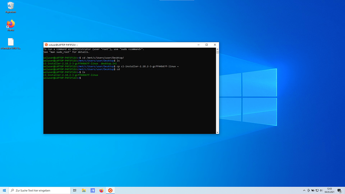

# Use CI Fuzz on Windows With WSL

This article shows how to setup CI Fuzz on Windows. In short, we will install the ci-daemon inside the WSL and will setup VS Code to communicate with it. In the end you will be able to use all the same features that are available in CI Fuzz on Linux.

First, you need to install WSL 2 as described in the Windows 10 documentation. In this tutorial, we will use Ubuntu 20.04 as the Linux distribution running inside WSL 2.

Next, install Docker Desktop in Windows 10. In the docker-installer select to install the required Windows components for WSL 2. This way the ci-daemon can use this docker installation as a backend and we don't need to install docker inside the WSL.
